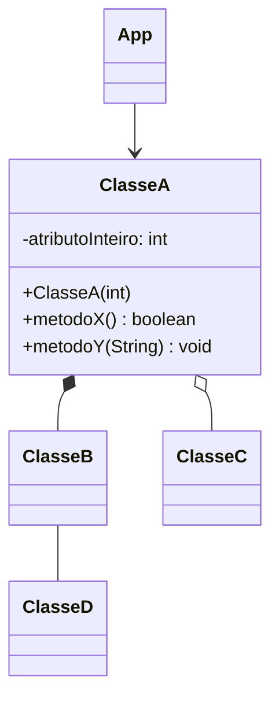

# Exercício Zoológico

## Parte 1 - Herança

Nesta primeira parte vamos exercitar os **conceitos básicos de herança** e ver como eles nos ajudam a **evitar duplicação de código** nas classes que **formam** uma hierarquia de herança.

### Passo 1.1 - Modelar as classes

*Atenção:* Este passo não envolve implementação; deve ser respondido aqui no próprio arquivo README.

Suponha que queiramos criar um sistema para um Zoológico que precise tratar as seguintes espécies de animais: tigre, chimpanzé, avestruz e tucano.

- Sabe-se que todos os animais têm as seguintes características: um nome, uma espécie, uma determinada quantidade de patas e um som característico (tecnicamente, sua onomatopeia, ex: se fosse um gato, seria “miau”, se fosse uma galinha: “cocorico”).
- Além disso, os animais que possuem pelo têm a informação da cor do seu pelo; já os animais que voam têm a informação se voam bem ou voam mal.

O sistema deve possuir:

- Métodos para consulta de cada atributo de todos os animais.
- Método que retorne uma string com a descrição resumida de um animal, conforme os exemplos abaixo: 
  - `Simba é um(a) tigre`.
  - `Blue é um(a) tucano`.
- Método que retorne uma string com a descrição completa de um animal, como a do exemplo abaixo: 
  - `Simba é um(a) tigre que faz grrrr e tem pelo laranja`.
  - `Blue é um(a) tucano que faz tuc-tuc e voa bem`.

Neste passo você deve apenas **modelar as classes necessárias** para representar todos os animais utilizando o conceito de herança:

- Ou seja, você **deverá definir** apenas os nomes: de cada classe, dos seus atributos e seus métodos.
- Para isso: **altere esse arquivo README** com a sua definição das classes (no trecho abaixo) e **faça um commit**.

Dicas:
- Avalie cuidadosamente os atributos a serem definidos, evitando replicação de código.
- Lembre-se que suas classes não devem permitir que um programador crie objetos de animais que não façam sentido.
  - Por exemplo: não faz sentido criar um avestruz com três pernas, ou que faça "au au".
  - Portanto, avalie bem como os atributos devem ser inicializados (e quais classes precisam ser criadas).
- Uma classe que representa uma espécie de animal deve ter nome no singular, já que um objeto dessa classe representará um único animal.
  - Por exemplo, uma classe para representar um chimpanzé deveria se chamar `Chimpanze`, e não `Chimpanzes`.

> Escreva aqui sua resposta
>
> Exemplo de formato:
> 
> Classe A (herda de B) - Atributos: atr1, atr2 e atr3 - Métodos: metodoA, metodoB e metodoC

Classe Animal - Atributos: nome,espécie,quantidade de patas ,som - Métodos: construtor Animal , getNome, getEspecie,getQtdPatas,getSom,descricao,descricaoCompleta

Classe Mamifero(herda de Animal) - Atributos: corDoPelo  Métodos:Construtor Mamifero, getCorDoPelo, descricaoCompleta 

Classe Ave(herda de Animal) - Atributos: voaBem Métodos:Construtor Ave , getVoaBem , descricaoCompleta

Classe tigre(herda de mamifero)
Classe chimpanzé(herda de mamifero)
Classe avestruz(herda de ave)
Classe tucano(herda de ave)

### Passo 1.2 - Implementar a Hierarquia de Herança

*Dica: Antes de começar esse passo, valide a sua modelagem do passo anterior com o professor.
Isso poderá evitar retrabalho na implementação.*

Neste passo você deve **implementar todas as classes** necessárias para representar os animais, e que você definiu no passo anterior.

Dicas:
- Não crie todas as classes de uma vez. Comece criando apenas o necessário para ter objetos de uma única espécie.
- Em seguida, na classe que tem o método `main`, crie um objeto daquela espécie e chame alguns métodos diretamente no código para testar sua implementação.
- Depois de validar e garantir que está tudo certo com a primeira classe, aí sim crie as classes para as demais espécies.

Não se esqueça de fazer um commit ao terminar esse passo.

### Passo 1.3 - Criar a classe Zoologico

**Crie uma classe chamada `Zoologico`** que gerencie os objetos de cada espécie. 

A classe deverá ter:

- Uma coleção (`ArrayList` ou `HashMap`) para cada espécie de animal.
   - Obs.: mesmo que já conheça polimorfismo, por objetivos didáticos, é importante que crie coleções separadas neste exercício.
- Métodos para adicionar animais de cada espécie de animal.
  - Os métodos devem receber os dados necessários e dentro deles é que os objetos serão criados.

- Método que recebe o nome de um animal e retorna sua descrição completa.
- Método que lista a descrição resumida de todos os animais do zoológico.
- Método que lista a descrição completa de todos os animais do zoológico.

O código inicial de uma classe `InterfaceUsuario`, que implementa o menu de opções para o usuário do programa, já foi fornecido para você.
Você deverá **alterar a classe `InterfaceUsuario`** para que ela chame os métodos da sua classe `Zoológico` (e obtenha dados do usuário, quando necessário).

Teste suas implementações!

Ao final, não se esqueça de fazer um commit e sincronizar suas alterações.

## Parte 2 - Diagrama de Classes UML

Vamos agora aprender a criar **diagramas de classes UML** para nossos projetos.

**Importante**: nesse exercício nós vamos fazer o inverso do que seria ideal, pois nós vamos criar um Diagrama de Classes depois de já ter implementado o código.
Vamos fazer isso para que seja mais simples entender como fazer um diagrama.
Mas o correto na verdade seria primeiro pensar na modelagem e fazer o Diagrama de Classes para depois implementar o código.

### Passo 2.1 - Diagrama de Classes Simplificado

Crie um diagrama de classes simplificado para o projeto do Zoológico (veja dicas sobre como fazer mais abaixo):

- Neste tipo de diagrama, basta representar as classes (não é necessário representar atributos e nem métodos).

### Passo 2.2 - Diagrama de Classes Completo

*Dica: valide com o professor o diagrama do passo anterior antes de fazer o diagrama completo*

Crie agora um diagrama de classe completo, incluindo os atributos e métodos de todas as classes.

#### Dicas para fazer o Diagrama de Classes UML

Para fazer o diagrama você pode optar por usar:

- um software qualquer (como o `Dia`).
- ou um algum editor online como o https://www.diagrameditor.com/
- ou ainda usar o `Mermaid` que permite fazer o diagrama aqui mesmo, diretamente no arquivo README do projeto.

Caso use um software ou um editor online, exporte a modelagem para uma imagem no formato `png` e coloque o arquivo em uma pasta `doc` dentro da pasta principal do projeto.

Já o `Mermaid` é interessante pois o GitHub possui uma integração com ele que permite exibir um diagrama de classes UML em um arquivo Markdown, como este arquivo README.
Para isso, basta "escrever" o diagrama de classes usando a [sintaxe](https://mermaid.js.org/syntax/classDiagram.html) do `Mermaid`, como no exemplo abaixo.

> Obs.: Para que você consiga visualizar o Diagrama de Classes dentro do VS Code, instale a extensão `Markdown Preview Mermaid Support` e acesse a visualização do arquivo README.md (atalho Ctrl+Shift+V).

## Parte 3 - Polimorfismo

Nesta terceira parte vamos exercitar **os conceitos de polimorfismo** e perceber como eles nos ajudam a **evitar duplicação** de código nas classes que **utilizam** classes de uma hierarquia de herança.

### Passo 3.1 - Experimentando Polimorfismo 1

Vamos começar exercitando nosso entendimento sobre os conceitos de polimorfismo.
Para isso, crie uma classe chamada `Teste` com um método `main` e, dentro dele, faça o seguinte:

- Declare uma variável chamada `animal` do tipo `Animal` e atribua a ela um objeto da classe `Tigre`.
- Chame o método `getNome` usando a variável `animal`.
- Agora, usando a mesma variável `animal`, atribua a ela um objeto da classe `Tucano`.
- Chame o método `getNome` usando a variável criada.

Explique abaixo, da forma mais completa possível, como é possível que a mesma variável `animal` possa ser usada para chamar métodos de objetos de classes diferentes.

>  A variável 'animal' pode ser usada para chamar métodos de objetos de classes diferentes porque o tipo da variável é Animal , os métodos que chamamos e as atribuições só foram possíveis porque são subtipos e herdam atributos e métodos da Classe Animal.O que isso quer dizer é que ao declarar uma variavel do tipo animal e ela é interpretada pelo compilador como sendo do tipo animal e estática e o compilador verifica se na classe pai possue os metodos se sim não ocorre erro de compilação , ao fazer as atribuições e metodos o só é possível através da JVM que interpreta as atribuições durante a execução do programa e a variável do tipo animal passa a ser do tipo dinamico referenciando uma classe filha e usando os metodos conhecidos pela classe pai , a variavel é dinamica porque pode assumir diferentes formas em tempos diferentes.

Ao terminar, faça um commit com as alterações da classe `Teste` e as alterações neste arquivo README.

### Passo 3.2 - Experimentando Polimorfismo 2

Agora, altere o método `main` da classe `Teste` e faça o seguinte:
- Crie um método chamado `exibirDescricaoCompleta` que recebe uma variável do tipo `Animal`.
  - Dentro dele, chame o método de descrição completa usando o parâmetro `animal`.
  - E exiba o resultado na tela.
- No método `main`, chame o método `exibirDescricaoCompleta` passando um objeto da classe `Tigre`.

O que é exibido?

>  É exibido "samba é um(a) Tigre que faz RRAAARRRRR e tem pelo vermelho" que é a descricao completa do tigre.

O método de descrição completa chamado inicialmente pertence a qual classe?

>  A classe zoologico.

Agora chame o método `exibirDescricaoCompleta` passando um objeto da classe `Avestruz`.

O que é exibido?

> É exibido "cuzcuz é um(a) Avestruz que faz tam-tam, aaahn e voa mal" que é a descricao completa do avestruz.

O método de descrição completa chamado inicialmente pertence a qual classe?

>  A classe animal.

Explique, da forma mais completa possível, como o mesmo trecho de código (método `exibirDescricaoCompleta`) pode ser usado para chamar métodos de classes diferentes.

>  Podemos usar o trecho de código (método `exibirDescricaoCompleta`) para chamar métodos de classes diferentes por causa do polimorfismo de método . Esse método recebe um objeto animal como parametro e a Classe animal é uma superclasse e tem um supertipo . A variável passada por parametro é polimorfica (dinamica) e pode referenciar em um instante de tempo uma subclasse de Animal(tucano,avestruz,chimpanze,tigre) e essa variavel atráves do princípio da substituição pode ser usada para chamar metodos de diferentes classes , já que a váriavel passada por parametro tem a possibilidade de usar um objeto de uma subclasse aonde um objeto da superclasse é esperado , oque isso significa ? ao passar por parametro um objeto animal se espera um objeto do tipo animal , mas o que passamos são objetos de uma subclasse de animal (tucano,avestruz,chimpanze,tigre).No código o compilador atua de f

Ao terminar, faça um novo commit com as alterações (na classe Teste e neste arquivo README).

### Passo 3.3 - Usando Polimorfismo no Projeto Zoologico

Vamos agora perceber como o polimorfismo ajuda a reduzir a replicação de código. 

Para isso, você deve alterar a classe `Zoologico`:

- Substitua as coleções de animais de cada espécie por uma única coleção (`ArrayList` ou `HashMap`) com todos os animais.
- E, devido a essa modificação, implemente as alterações necessárias nos métodos da classe.
- **Atenção**: deixe o código anterior comentado para que o professo consiga corrigir a Parte 1 e a Parte 3 do seu exercício.

Do ponto de vista do usuário, seu programa deverá continuar funcionando da mesma forma que você havia feito no exercício da aula anterior.
Mas repare que agora seu projeto terá um *Design* de classes melhor.

Teste suas alterações!

Ao final, faça um novo commit no seu repositório.

### Passo 3.4 - Identificando o uso de Polimorfismo

Para todas as perguntas abaixo, você deve indicar exatamente a classe e o número da linha de código onde cada situação acontece.

1. Indique pelo menos uma **variável polimórfica** utilizada no seu código e explique porque ela é uma variável polimórfica.

> Nome da classe: Zoologico
> 
> Número da linha: 121
> 
> Nome da variável: animais
> 
> Explicação: A variável animais, é um objeto da classe HashMap<String, Animal>. Essa variável é usada para armazenar objetos de diferentes subclasses da classe Animal, como Tigre, Chimpanze, Tucano e Avestruz. Essa abordagem permite armazenar diferentes tipos de animais no mesmo HashMap, aproveitando o polimorfismo para acessar os métodos específicos de cada subclasse através de referências da superclasse Animal. 

2. Identifique algum ponto no código onde está sendo usado o **princípio da substituição** e explique o que é este princípio.

> Nome da classe:Zoologico
> 
> Número da linha:142
> 
> Explicação: O princípio da substituição é a possibilidade de usar um objeto de uma subclasse onde um objeto da superclasse é esperado , ou seja , em substituição a ele. Sabendo o conceito , na linha 142 o treco de código "animais.get(nome).descricaoCompleta()" , esse trecho espera receber um objeto de uma superClasse animal do tipo HashMap , no trecho essa variável é polimorfica e pode receber objetos de subclasses da superClasse animal como (tucano,tigre,avestruz,chimpanze), ou seja , dependendo do parametro (nome) , a variavel por ser dinamica pode ter seu tipo sendo um avestruz e chamar o método específico para a classe, descricaoCompleta() que a classe pode utilizar por conta da herança.

3. Identifique algum ponto no código onde uma variável tem **tipo estático diferente de seu tipo dinâmico** (indique quais são os tipos estático e dinâmico da variável neste ponto).

> Nome da classe:Zoologico
> 
> Número da linha:121
> 
> Nome da variável:tigre
> 
> Tipo estático:Tigre
>
> Tipo dinâmico:Animal

4. Identifique onde ocorre uma chamada de método na qual seja utilizado o conceito de **polimorfismo de método**.

> Nome da classe:Mamifero
> 
> Número da linha:17

### Passo 3.5 - Atualização do Diagrama de Classes

Faça as alterações necessárias nos diagramas de classes para que eles representem o seu código alterado após o passo 2.3.

Obs.: não é necessário incluir a classe `Teste`.

>  Dica: Cuidado com linhas se cruzando no diagrama de classes, pois podem confundir os relacionamentos.

